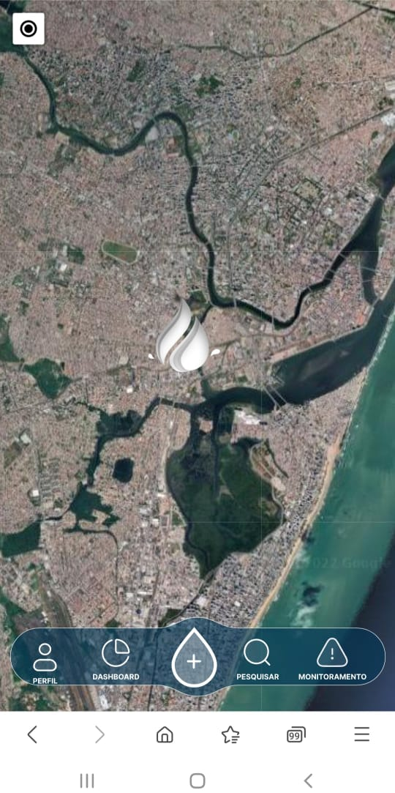

# AquaVision

> Aplicativo criado para a facilitação no monitoramento da qualidade da água em rios e reservatórios.

## 💻 Pré-requisitos

Antes de começar, verifique se você atendeu aos seguintes requisitos:

* Você tem uma máquina `<Windows / Linux / Mac>`.
* Você precisa ter instalado em sua máquina: `<node.js, npm e ionic>`.

## ☕ Como rodar o projeto

Para usar <nome_do_projeto>, siga estas etapas:

* Instalando o ionic: `<npm install -g @ionic/cli>`
* Rodando o app: `<ionic serve>`

## 🤝 Colaboradores
